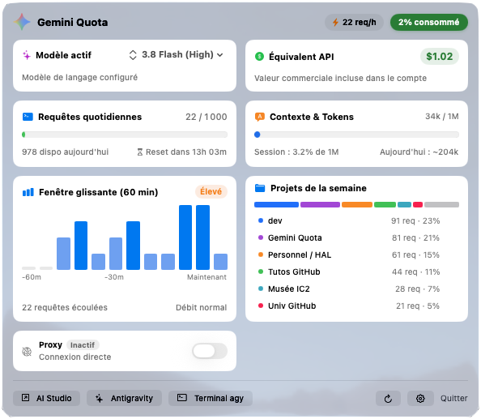

# GeminiQuota

Application macOS native (Swift / SwiftUI) pour la barre des menus affichant en temps réel la consommation du quota quotidien Gemini, le contexte de tokens et les métriques de travail de l'agent IA Google Antigravity, en prenant en charge indifféremment l'application de bureau (**Antigravity.app**), le terminal (**`agy`**) et l'IDE.

<p align="center">
  
</p>

---

## Fonctionnalités

- **Icône dynamique en barre des menus** : Jauge colorée et pourcentage de consommation mis à jour en temps réel.
- **Suivi des quotas & tokens** : Compteur de requêtes journalières (limite de 1 000/jour avec compte à rebours avant minuit), jauge de contexte 1M tokens et estimation de l'équivalent commercial API.
- **Sélecteur de modèle IA** : Affichage du modèle actif et changement direct à la volée via un menu déroulant.
- **Activité 60 min & Détection 429** : Histogramme du débit récent, détection instantanée des saturations serveur (`RESOURCE_EXHAUSTED`) avec estimation du temps de déblocage.
- **Suivi multi-projets** : Répartition de l'activité par projet sur la semaine avec lanceurs rapides vers le terminal (`agy`), Antigravity.app ou le Finder.
- **Notifications natives macOS** : Alertes automatiques aux seuils de consommation (80%, 90%, 100%) et notification de rétablissement de quota.
- **Contrôle rapide du proxy** : Interrupteur ON/OFF pour injecter ou désactiver instantanément les variables proxy dans vos sessions de terminal.

---

## Structure du Projet

```text
~/dev/gemini-quota/
├── Sources/
│   └── main.swift          # Code source Swift (SwiftUI, MenuBarExtra, AppKit)
├── Resources/
│   ├── Info.plist          # Métadonnées de l'application (LSUIElement = true)
│   └── AppIcon.icns        # Icône officielle Google Gemini Retina multi-résolution
├── build.sh                # Script de compilation, packaging et déploiement
├── geminiquota.png         # Capture d'écran du tableau de bord
├── .gitignore
├── LICENSE
└── README.md
```

---

## Compilation et Lancement

Pour compiler l'application et la déployer dans `~/Applications/GeminiQuota.app` :

```bash
cd ~/dev/gemini-quota
./build.sh
```

Le script :
1. Compile le code source avec `swiftc` en mode optimisé (`-O -target arm64-apple-macos13.0`).
2. Met à jour le bundle `~/Applications/GeminiQuota.app`.
3. Relance automatiquement l'application dans la barre des menus.

---

## Configuration (Terminal & Proxy)

Un fichier de configuration optionnel est situé dans :
`~/Library/Application Support/GeminiQuota/config.json`

*(Vous pouvez l'ouvrir à tout moment en cliquant sur le bouton réglages **⚙️** dans la barre inférieure, ou via un **clic droit** sur le bouton terminal).*

```json
{
  "terminal": "Ghostty",
  "application": "agy",
  "working_directory": "~/dev",
  "proxy_enabled": true,
  "notifications_enabled": true,
  "notify_threshold_80": true,
  "notify_threshold_90": true,
  "notify_threshold_100": true,
  "notify_on_429": true,
  "notify_sound": true,
  "http_proxy": "http://proxy.entreprise.com:8080",
  "https_proxy": "http://proxy.entreprise.com:8080",
  "all_proxy": "",
  "no_proxy": "localhost,127.0.0.1,*.entreprise.com"
}
```

- **`notifications_enabled`** : Active ou désactive globalement les notifications système macOS (par défaut : `true`).
- **`notify_threshold_80`** / **`notify_threshold_90`** / **`notify_threshold_100`** : Alertes individuelles aux paliers de 80%, 90% et 100% de requêtes consommées (par défaut : `true`).
- **`notify_on_429`** : Alerte immédiate lors d'un blocage serveur 429 et notification de rétablissement (par défaut : `true`).
- **`notify_sound`** : Émission du carillon sonore par défaut lors des notifications (par défaut : `true`).
- **`application`** : Commande ou binaire à exécuter automatiquement dans le terminal (par défaut : `agy`). Alias acceptés : `app`, `command`.
- **`working_directory`** : Dossier de départ à ouvrir dans le terminal (ex: `"~/dev"` ou `"/Users/lehuen/dev"`). Le tilde `~` est automatiquement résolu. Si vide (`""`) ou non spécifié, GeminiQuota bascule automatiquement sur le workspace actif détecté, ou à défaut sur le dossier personnel (`~`). Alias acceptés : `directory`, `workdir`.
- **`terminal`** : Nom de l'application terminal (`Terminal`, `iTerm`, `Ghostty`, `kitty`, `Alacritty`, `Warp`, etc.) ou chemin absolu vers l'application. Si le champ est vide (`""`) ou non spécifié, GeminiQuota utilise le terminal par défaut du Mac (`Terminal.app`).
- **`proxy_enabled`** : État d'activation du proxy (`true` ou `false`). Ce paramètre est directement synchronisé avec l'**interrupteur Proxy** dans la popover de l'application.
- **Interrupteur Proxy (UI)** :
  - **Actif (ON)** : Injecte automatiquement les variables `HTTP_PROXY`, `HTTPS_PROXY`, `ALL_PROXY` et `NO_PROXY` dans le terminal.
  - **Inactif (OFF)** : Exécute `unset` sur toutes les variables de proxy pour garantir une connexion directe, même si un proxy est défini dans `.zshrc`.
- **`http_proxy` / `https_proxy` / `all_proxy` / `no_proxy`** : Variables d'environnement de proxy configurées.

---

## Lancement automatique au démarrage (optionnel)

Pour lancer `GeminiQuota.app` automatiquement à l'ouverture de session macOS :
- Aller dans **Réglages Système > Général > Ouverture**.
- Cliquer sur le **+** sous *Ouvrir avec la session* et sélectionner `~/Applications/GeminiQuota.app`.

---

## À propos

Par souci de transparence, cette application a été quasi-intégralement conçue et développée en pair-programming avec l'assistance de **Google Gemini** (via les modèles Gemini et l'environnement Antigravity).

---

## Licence

Ce projet est distribué sous [licence MIT](LICENSE). Développé par **Jérôme Lehuen**.

